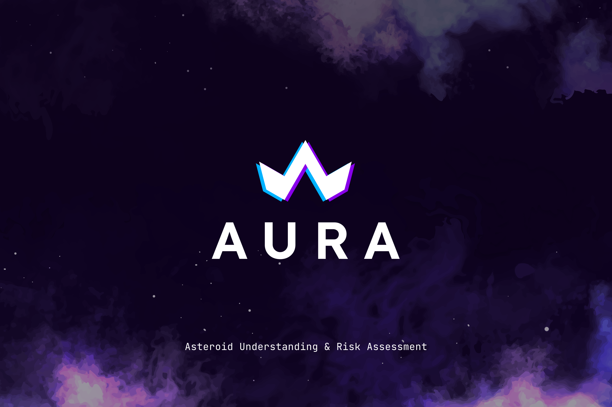

# Neo-Aura Frontend



A sophisticated asteroid impact simulation frontend built with React, TypeScript, and Three.js for real-time visualization of Near Earth Objects (NEOs) and asteroid impact scenarios.

## Quick Navigation

### Core Features
- **[3D Simulation](#3d-simulation)** - Real-time 3D visualization with orbital mechanics
- **[NEO Visualization](#neo-visualization)** - Interactive Near Earth Objects with NASA data
- **[Impact Analysis](#impact-analysis)** - Comprehensive impact prediction and analysis
- **[Orbital Mechanics](#orbital-mechanics)** - Accurate physics calculations and trajectories
- **[Console Interface](#console-interface)** - Terminal-inspired scientific interface

### Technical Documentation
- **[Setup & Installation](#setup--installation)** - Complete development environment setup
- **[Technology Stack](#technology-stack)** - Detailed tech stack with versions
- **[Physics Calculations](#physics-calculations)** - Mathematical formulas and constants
- **[API Integration](#api-integration)** - NASA NEO API and data sources
- **[Performance Optimization](#performance-optimization)** - 3D rendering and memory management

## Features

### 3D Simulation
- **Real-time 3D visualization** of asteroid trajectories
- **Orbital mechanics** with accurate physics calculations
- **Interactive camera controls** with zoom, pan, and rotate
- **Multiple asteroid types** (original, deflected, collision)
- **Dynamic lighting** and starfield background

### Console-Style Interface
- **Terminal-inspired legend** with JetBrains Mono font
- **Transparent console panel** with green terminal colors
- **Real-time status badges** for simulation states
- **Scientific distance formatting** with superscript notation
- **Asteroid information display** with name and ID

### Advanced Settings
- **Collapsible settings panel** with smooth animations
- **Comprehensive controls** for all simulation parameters
- **Persistent settings** with local storage
- **Tooltips and help** for each control
- **Organized sections** (Display, Lighting, Stars, Grid, Physics, Timing)

### Physics Simulation
- **Impact analysis** with real-time calculations
- **Trajectory optimization** with collision detection
- **Energy calculations** and impact predictions
- **Geographic impact mapping** with land/ocean detection
- **Seismic wave visualization** and energy distribution

## Technology Stack

### Frontend Framework
- **React 19.1.1** - Modern React with concurrent features
- **TypeScript 5.8.3** - Type-safe development
- **Vite 7.1.7** - Fast build tool and dev server

### 3D Graphics & Visualization
- **Three.js 0.180.0** - Core 3D graphics library
- **React Three Fiber 9.3.0** - React integration for Three.js
- **React Three Drei 10.7.6** - Useful helpers and abstractions
- **Leva 0.10.0** - GUI controls for 3D parameters

### State Management & Data
- **Zustand 5.0.8** - Lightweight state management
- **SWR 2.3.6** - Data fetching with caching
- **Jotai 2.14.0** - Atomic state management

### UI & Styling
- **Tailwind CSS 4.1.14** - Utility-first CSS framework
- **Shadcn/ui** - Modern component library
- **Radix UI** - Accessible component primitives
- **Lucide React 0.544.0** - Icon library
- **JetBrains Mono** - Monospace font for console interface

### Development Tools
- **ESLint 9.36.0** - Code linting
- **TypeScript ESLint 8.44.0** - TypeScript-specific linting
- **Vite Plugin React SWC 4.1.0** - Fast React compilation

## Project Structure

```
src/
├── components/
│   ├── simulation/          # 3D simulation components
│   ├── controls/            # UI control components
│   ├── views/               # Main view components
│   └── ui/                  # Reusable UI components
├── hooks/                   # Custom React hooks
├── store/                   # Zustand state management
├── config/                  # Configuration and constants
├── types/                   # TypeScript type definitions
└── utils/                   # Utility functions
```

## Key Components

### SimulationScene
- Main 3D scene orchestrator
- Handles all 3D object rendering
- Manages camera and lighting
- Coordinates between UI and 3D elements

### Legend
- Console-style information panel
- Real-time status display
- Asteroid information
- Scientific distance formatting

### SimulationSettings
- Comprehensive settings panel
- Collapsible sections with animations
- Persistent configuration
- Tooltips and help system

### Labels
- Distance calculation and display
- Real-time position tracking
- Scientific notation formatting

## Setup & Installation

### Prerequisites
- **Node.js 18+** - Required for React 19 and modern JavaScript features
- **pnpm** (recommended) - Fast, disk space efficient package manager
- **Git** - For version control and cloning the repository

### Environment Setup

1. **Clone the repository**
   ```bash
   git clone https://github.com/your-username/neo-aura.git
   cd neo-aura
   ```

2. **Install dependencies**
   ```bash
   pnpm install
   ```

3. **Configure environment variables**
   Create a `.env.local` file in the root directory:
   ```env
   VITE_NASA_API_KEY=your_nasa_api_key_here
   ```

4. **Start development server**
   ```bash
   pnpm dev
   ```

5. **Open in browser**
   Navigate to `http://localhost:5173`

### Build for Production
```bash
pnpm build
```

### Preview Production Build
```bash
pnpm preview
```

### Code Quality
```bash
pnpm lint
```

## Design Philosophy

### Console Aesthetics
- **Terminal-inspired interface** with monospace fonts
- **Transparent panels** with backdrop blur
- **Green terminal colors** for authentic console feel
- **Bracket notation** for status indicators

### Scientific Accuracy
- **Real astronomical units** for distances
- **Proper physics calculations** for trajectories
- **Scientific notation** with superscript formatting
- **Accurate orbital mechanics** simulation

### User Experience
- **Smooth animations** for all interactions
- **Intuitive controls** with clear labeling
- **Responsive design** for different screen sizes
- **Performance optimization** for real-time 3D rendering

## Performance Features

- **Efficient 3D rendering** with optimized geometries
- **Smart object culling** for distant objects
- **LOD (Level of Detail)** for complex scenes
- **Memory management** for long-running simulations
- **Smooth 60fps** animation performance

## Physics Calculations

### Astronomical Constants
```typescript
// Distance and size constants
const AU_IN_KM = 149597870.7;        // Astronomical Unit in kilometers
const EARTH_RADIUS_KM = 6371;        // Earth's radius in kilometers
const SUN_RADIUS_KM = 696000;        // Sun's radius in kilometers
const SECONDS_PER_DAY = 86400;       // Seconds in a day

// Visual scaling for 3D simulation
const AU_TO_UNITS = 2.0;             // 1 AU = 2 units in 3D space
const SUN_VISUAL_RADIUS = 0.15;      // Sun radius in 3D units
const EARTH_VISUAL_RADIUS = 0.08;    // Earth radius in 3D units
```

### Orbital Mechanics
The simulation uses **Kepler's laws** and **Newton's laws of motion**:

1. **Kepler's First Law**: Orbits are elliptical with the Sun at one focus
2. **Kepler's Second Law**: Equal areas are swept in equal times
3. **Kepler's Third Law**: T² ∝ a³ (period squared proportional to semi-major axis cubed)

### Gravitational Force Calculation
```typescript
// Newton's law of universal gravitation
F = G * (m1 * m2) / r²

// Where:
// F = gravitational force
// G = gravitational constant (6.674 × 10⁻¹¹ m³/kg⋅s²)
// m1, m2 = masses of the two objects
// r = distance between centers of mass
```

### Impact Energy Calculations
```typescript
// Kinetic energy of impact
KE = 0.5 * m * v²

// Where:
// KE = kinetic energy (Joules)
// m = mass of asteroid (kg)
// v = velocity at impact (m/s)

// Energy conversion to TNT equivalent
TNT_equivalent = KE / (4.184 × 10⁹) // Joules to kilotons of TNT
```

### Seismic Wave Modeling
```typescript
// Richter magnitude calculation
M = log₁₀(A) + 2.56 * log₁₀(D) - 1.67

// Where:
// M = Richter magnitude
// A = amplitude of seismic wave
// D = distance from epicenter
```

### Geographic Impact Prediction
- **Land vs Ocean Detection**: Uses geographic coordinate mapping
- **Population Density**: Calculates affected population within impact radius
- **Infrastructure Damage**: Models damage zones based on impact energy

## API Integration

### NASA NEO API
The application integrates with NASA's Near Earth Object Web Service:

- **Endpoint**: `https://api.nasa.gov/neo/rest/v1/feed`
- **Authentication**: API key required (`VITE_NASA_API_KEY`)
- **Data Retrieved**:
  - Orbital elements (semi-major axis, eccentricity, inclination)
  - Close approach data (date, distance, velocity)
  - Physical properties (diameter, absolute magnitude)
  - Hazardous classification

### Data Processing
```typescript
// NEO data structure
interface NEOData {
  id: string;
  name: string;
  is_potentially_hazardous: boolean;
  estimated_diameter: {
    kilometers: { min: number; max: number };
  };
  orbital_data: {
    semi_major_axis: string;
    eccentricity: string;
    inclination: string;
    orbital_period: string;
  };
  close_approach_data: Array<{
    close_approach_date: string;
    miss_distance: { kilometers: string };
    relative_velocity: { kilometers_per_second: string };
  }>;
}
```

### Caching Strategy
- **SWR (Stale-While-Revalidate)**: Automatic caching with background updates
- **TTL**: 24-hour cache for NEO data
- **Fallback**: Demo data when API is unavailable

## Future Enhancements

- **Multi-asteroid simulations**
- **Advanced trajectory optimization**
- **Real-time data integration**
- **Enhanced visualization modes**
- **Export capabilities** for analysis results
- **Machine learning** for impact prediction
- **Collaborative simulation** features

---

Built for asteroid impact simulation and planetary defense research.